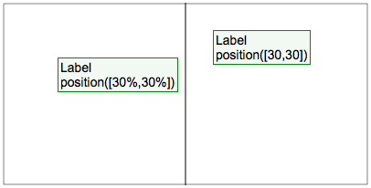
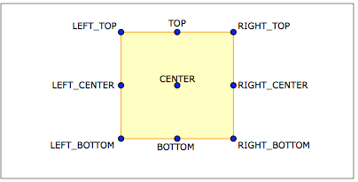
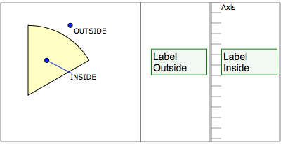
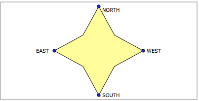
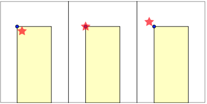
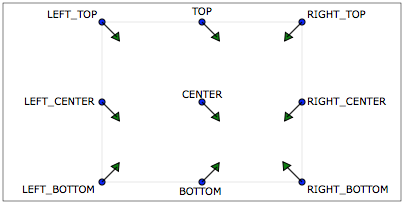
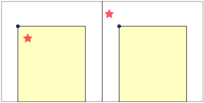

# Позиционирование элементов визуализации и корректировака их положения #

* [Introduction](#intro)
* [Method position()](#m-position)
* [Method anchor()](#m-anchor)
* [Method offestX() or offsetY()](#m-offsets)

{sample}sample{sample}

## [Introduction](id:intro)
Позиционирование таких элементов как Маркер, Лейбл, Мультимаркер и Мультилейбл происходит при помощи трех методов: **position**, **anchor**, **offsetX**, **offsetY**.
Это обязательные методы для каждого из этих элементов.
  
Ниже мы рассмотрим принцип работы этих методов и их взаимосвязь на итоговом позиционировании элеметна.

## [Method position()](id:m-position)
Данный метод определяет текущее местоположение элемента на области чарта в целом.
То есть он определяет, так называемую, **точку позиционирования** элемента.

В качестве параметра метод **position** принимает либо координату, либо строковое значение.
Рассмотрим подробнее:

### Координаты/значения
**Для случая простого Маркера и простого Лейбла.**

Принимаемая кордината считается в относительных координатах контейнера, в котором находится текущий элемент.
  
Более того, можно предавать не только точные значения, но и относительные (в процентах).

 

### Произвольное строковое значение
**Для множественного Маркера и множественного Лейбла.**
В таком случае элементы привязываются к требуемым объектам (на которых Вы хотели бы их видеть, например, точки на серии или тики на оси).

Во фреймворке есть и продопределенные значения для определения положения, отвечающие за позиционирование элемента на привязанном объекте. 
Так, например, для прямоугольных объектов (допустим это точка Bar серии) значение **position** берется из Enum **anychart.utils.NinePositions**

Для точек Pie-серии или же для лейблов оси используются Enum (to-do: outside/inside)

Произвольное строковое значение Вы можете сами обрабатывать на этапе формирования *positionProvider*. Например, Вы сами можете определить собственные значения для позиционирования, а затем использовать их при рассчетах.

## [Method anchor()](id:m-anchor)
После того, как элемент спозиционирован при помощи метода **position**, его положением вокруг точки позиционирования можно управлять с помощью метода **anchor**.

Метод принимает значения из Enum'a **anychart.utils.NinePositions**. Пример ниже показывает принцип его работы.

На картинке синей точкой обозначена точка позиционирования маркера (красной звезды) на баре.
Слева направо значение **anchor**: LeftTop, Center, RightBottom.

## [Method offestX() or offsetY()](id:m-offsets)

 После того, как элемент был спозиционирован, его окончательное положение можно скорректировать при помощи методов **offsetX** и **offsetY**.
 Данные методы принимают значение на которое смещают элемент по одной из осей, но смещение происходит в зависимости от текущего значения **anchor**. Рассмотрим на картике зависимость смещения по оси от значения **anchor**.
 
 
 
 
 Стрелками обозначено направление смещение при положительно заданных значениях offsets.
 
 Ниже наглядно показано как считается отклонение 10 по X и 15 по Y для **anchor** LeftTop (слева) и RightBottom (справа):

