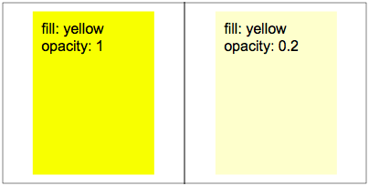
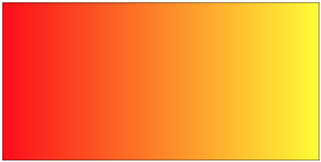
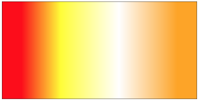
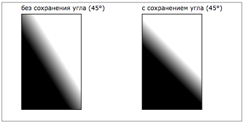
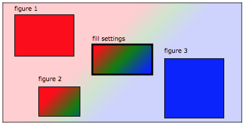
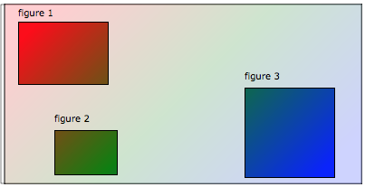
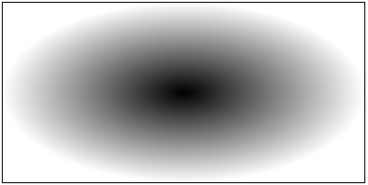
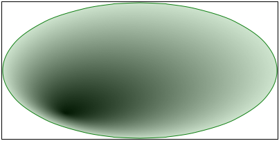
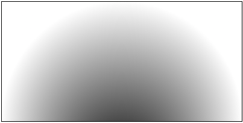
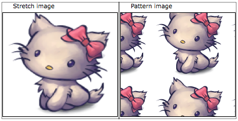

# Настройки бордера элемнтов.
* [1. Сплошной цвет](#solid-color)
* [2. Линейный градиент](#linear-gradient)
* [3. Радиальный градиент](#radial-gradient)
* [4. Заливка изображением](#image-fill)

## [1. Сплошной цвет](id:solid-color)
Простейшей заливкой является заливка сплошным цветом. 
Цвет можно задать в форматах:
* Hex
* RGB
* HSL
* HTML color name

Рассмотрим как можно задать прозрачность цвета:
* c помощью модификаторов: RGBA, HSLA.
* либо отдельным параметром:
    * вызов метода с параметрами <code>fill(_color_, _**opacity**_);</code>
    * одним значением <code>fill('color **opacity**')</code>
 (то есть значения одной строкой разделенные пробелом).

## [2. Линейный градиент](id:linear-gradient)

### 2.1. Обязательным параметром
для заливки линейным градиентом являются **ключи градиента**.
 Ключ градиента представляет собой пару: настройка цвета (сам цвет и 
 прозрачность) и его положение. Таких ключей должно быть более двух, иначе заливка
 будет сплошной.

Пример двустопного градиента:

Пример многостопного градиента:

### 2.2. Дополнитьельные параметры
* **прозрачность** - задает прозрачность всему градиенту
* **угол** - задает угол наклона градиента (зависит от режима)
* **режим заливки** читай ниже

### 2.3. Режимы заливки

#### 2.3.1 ObjectBoundingBox без сохранения угла
Режим заливки, при котором вектор градиента расчитывается под заданным углом, 
 но в фигуре с соотношением сторон не 1:1 он будет измнен браузером (сжат 
 пропорционально соотношению сторон) и визуально угол наклона вектора градиента 
 **не будет соответствовать** заданному.

#### 2.3.2. ObjectBoundingBox с сохранением угла
При этом режиме в любой фигуре угол наклона градиента визуально **будет 
 соответствовать** заданному. То есть, в отличие от предыдущего режима для фигур 
 с соотношением не 1:1, градиент в итоге визуально будет соответствовать
 заданному углу, при помощи дополнительных внутренних вычислений.

Рассмотрим их отличия на примере:

#### 2.3.3. UserSpaceOnUse
Режим заливки, при котором градиенту указываются собственные размеры и координаты
 внутри которых и производится рассчет (с учетом угла, аналогично режиму 2).
 Затем, данная заливка применяется к необходимому элементу, учитывая координаты 
 его контейнера.

Продемонстрируем принцип работы данного режима:

Как видно на изображении, настройки градиента обозначены **fill settings **, и
 при помощи даннго градиента закрашены области **figure 1-3**.

Стоит заметить, что если размеры контейнера в настройках градиента будут больше
 закрашиваемой области элемента, то будет иной эффект:

## [3. Радиальный градиент](id:radial-gradient)

### 3.1. Обязательными параметроми
для радиального градиента являются:
1. _ключей градиента_, как и в случае линейного градиента, не менее двух. 
2. _положение центра_, которые задаются **не в пикселях**, а в процентных 
 соотношениях от размеров контейнера (числом от 0 до 1).

Простая заливка радиальным градиентом c центром в точке (0.5, 0.5):

### 3.2. Дополнительные параметры
Расширенные настройки градиента:
* **прозрачность** - задает прозрачность всему градиенту.
* **область заливки** - тоже что и 1.2.3.3 (UserSpaceOnUse) в линейном градиенте.
 Если область заливки не задана, то заливается весь контейнер элемента, а также,
 если соотношение сторон области заливки не 1:1, то заливка растягивается до 
 эллипса.
* **положение фокальной точки** - как и положение центральной точки задается
 в соотношении сторон области заливки (числом от 0 до 1). **Заметка:** стоит
 помнить, что положение фокальной точки не должно выходить за рамки эллипса.

Пример с фокальной точкой. Именно за радиусы этого эллипса и не должно
 выходить положение фокальной точки.

Пример с заданой областью заливки

## [4. Заливка изображением](id:image-fill)
Для того, чтобы залить элемент изображением, в метод **fill** необходимо 
 передать объект, который содержит информацию об адресе до изображения (_src_) и
 режим заливки (растянуть/сжать картинку, сохранять пропорции или нет,
 использовать в качестве шаблона заливки).

