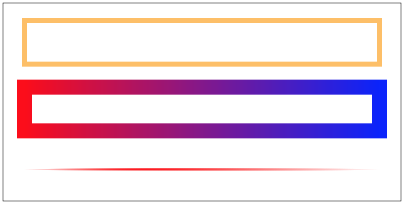

# Настройки stroke элементов.
* [1. Толщина и пунктир](#thickness-dashed)
* [2. Заливка цветом: сплошной цвет, линейный/радиальный градиент](#color)
* [3. Обработка углов](#line-join-cap)

## [1. Толщина и пунктир](id:thickness-dashed)
Толщина обводки просто задается числом в пикселях, аналогично позиции в ключе
 градиента ``

## [2. Заливка цветом: сплошной цвет, линейный/радиальный градиент](id:color)
Цвет у stroke задается аналогично fill. Только не поддерживается заливка
 картинкой.

Примеры с заливкой stroke:

