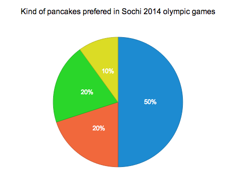

Quick Start
===========
### To start working with AnyChart framework you should do just three things:<br>

####1. Include anychart.min.js to your head section<br>
```
<head>
    <script src="cdn.anychart.com/anychart.min.js" type="text/javascript"></script> 
</head>
```
####2. Create block-based container with id attribute for your chart<br>
```
<body>
    <div id="chart-container" style="width: 500px; height: 400px;"></div>
</body>
```
####3. Insert following script section in any part of your page.<br>
```
    <script>
        anychart.onDocumentLoad(function() {
            var chart = new anychart.pie.Chart([ //create instance of pie chart with data
                ['Chocolate paste', 5],
                ['White honey', 2],
                ['Strawberry jam', 2],
                ['Сondensed milk', 1]
            ]);
            chart.title('Kind of pancakes prefered in Sochi 2014 olympic games');
            chart.container('chart-container'); //pass the container where chart will be drawn
            chart.draw(); //call chart draw method to initiate chart drawing
        });
    </script>
```

###After all you should have the following result

<span style="text-align:center; display:inline-block; width:100%;">
<br>
<span style="margin-left:300px;">
[Launch in playground](https://www.google.com "Launch in playground")
</span>
</span>
<br>
<br>


<h3 style="line-height:22px;padding-bottom:10px;">Here is a full snippet of code, you can copy this to a file on your computer and open it in your browser to display the pie chart shown above:
</h3>


```
<!doctype html>
<head>
    <script src="../../out/anychart.min.js"></script>
    <script>
        anychart.onDocumentLoad(function() {
            var chart = new anychart.pie.Chart([ //create instance of pie chart with data
                ['Chocolate paste', 5],
                ['White honey', 2],
                ['Strawberry jam', 2],
                ['Сondensed milk', 1]
            ]);
            chart.title('Kind of pancakes prefered in Sochi 2014 olympic games');
            chart.container('chart-container'); //pass the container where chart will be drawn
            chart.draw(); //call chart draw method to initiate chart drawing
        });
    </script>
</head>
<body>
	<div id="chart-container" style="width: 500px; height: 400px;"></div>
</body>
</html>
```

<h3 style="line-height:22px;padding-bottom:10px;">Also you may use any other JavaScript library to manage DOM ready event.<br> Here is example with jQuery:</h3>

```
	<script>
	    $(function() {
	        var chart = new anychart.pie.Chart([ //create instance of pie chart with data
	            ['Mushrooms', 3],
	            ['Onions', 1],
	            ['Olives', 1],
	            ['Zucchini', 1],
	            ['Pepperoni', 2]
	        ]);
            chart.title('Kind of pancakes prefered in Sochi 2014 olympic games')        
	        chart.container('chart-container'); //pass the container where chart will be drawn
	        chart.draw(); //call chart draw method to initiate chart drawing
	    });
	</script>
```
###Learn more:
1. [Supported charts types](https://www.google.com "Supported charts types")
2. [Working with data](https://www.google.com "Working with data")
3. [How to visualize well](https://www.google.com "How to visualize well")


